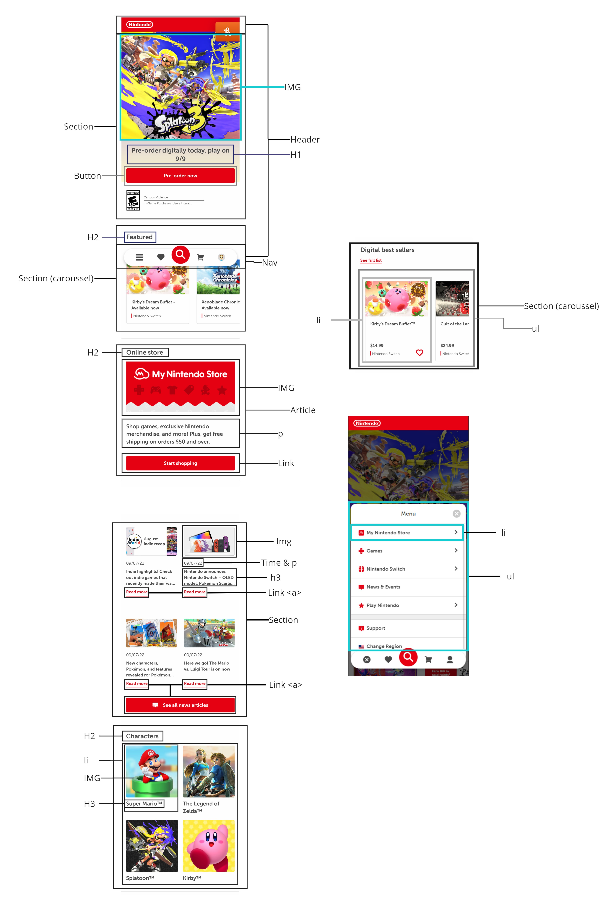

# Procesverslag
Markdown is een simpele manier om HTML te schrijven.  
Markdown cheat cheet: [Hulp bij het schrijven van Markdown](https://github.com/adam-p/markdown-here/wiki/Markdown-Cheatsheet).

Nb. De standaardstructuur en de spartaanse opmaak van de README.md zijn helemaal prima. Het gaat om de inhoud van je procesverslag. Besteedt de tijd voor pracht en praal aan je website.

Nb. Door *open* toe te voegen aan een *details* element kun je deze standaard open zetten. Fijn om dat steeds voor de relevante stuk(ken) te doen.

## Jij

  
uitwerken voor kick-off werkgroep

  ### Auteur:
  Guido de Waal (vervangen door jouw naam)

  #### Je startniveau:
  Rood

  #### Je focus:
  Surface Plane
 

## Je website

  
uitwerken voor kick-off werkgroep

  ### Je opdracht:
  nintendo.com

  #### Screenshot(s) van de eerste pagina (small screen): 
  hier de naam van de pagina  
  

  #### Screenshot(s) van de tweede pagina (small screen):
  hier de naam van de pagina  
  
 

## Toegankelijkheidstest 1/2 (week 1)

  
uitwerken na test in 1e werkgroep

  ### Bevindingen

  #### Screenreader
  Voor blinde mensen is de site slecht geoptimaliseerd. De tabs zijn wel goed. Maar voor sommige tekst en knoppen wordt er vanuit gegaan dat de pagina erbij wordt gezien. Zo is er bijvoorbeeld een knop met Read More. Maar je weet niet waar je meer over gaat lezen.

  Een aria label zou een oplossing kunnen zijn voor screenreaders. Zodat blinde mensen weten waar knoppen hun heen leiden als ze er op staan.

  #### Muis en Toetsenbord 
  Dit is vrij goed uitgewerkt. Alles wat je kan selecteren heeft een duidelijke tab state. Knoppen hebben zelfs nog een andere tab staat dan li elementen en nav elementen. Elementen zijn duidelijk verspreidt en er is een goed overzicht. Het contrast op de pagina is ook goed. Koppen hebben een hoog contrast ten opzichte van de achtergrond. En de buttons (rood) hebben net genoeg contrast ten opzichte van de achtergrond.
  Wel, zijn de nav elementen op de desktop site relatief klein.
  
  Sommige knoppen zouden wat groter kunnen. Vooral in de navigatie.

  

  #### Motoriek (shocks, elastiekjes)
  Met schocks is het wat lastig met de muis het navigatiemenu te navigeren. Deze knoppen zijn relatief wat kleiner.

 knoppen groter maken.

  #### Visueel (brillen, contrast, kleurenblind, dark/light). 
  Het contrast in de site is sterk, donker rood op wit springt goed uit er is ook genoeg ruimte overgelaten om deze er goed uit te laten springen. Knoppen zijn duidelijk knoppen. Iets wat verbetert zou kunnen worden is de items in het carrousel. Daar zijn de titels wat klein, waardoor het misschien lastig kan zijn om gemakkelijk te kunnen lezen. 

  De font size vergroten.

## Breakdownschets (week 1)

  
uitwerken na afloop 2e werkgroep

  ### de hele pagina + menu + carrousel: 
  

## Voortgang 1 (week 2)

  
uitwerken voor 1e voortgang

  ### Stand van zaken
  
 Ik heb alle html geschreven, maar nog niet alle content erin gedaan. Ik heb de secties in css verschillende kleuren gegeven zodat er blokken ontstaan en ik makkelijk overzicht heb. Ik heb nog niet heel veel css geschreven.

  ### Verslag van meeting
  hier na afloop snel de uitkomsten van de meeting vastleggen
  
  - Kijken of ik inderdaad beide openklappende sub menu's erin wil hebben, aangezien dit een hoop moeite kost en het voor lelijke html zorgt.
  - Extra aandacht besteden aan custom properties.
  - Er mag maar 1 H1 op de pagina. Ik heb 1 h1 per section.

Ik moet vooral ook op de order van de html elementen letten. Ik heb nu alles op "chronologische" volgorde. Waardoor  elementen boven aan staan.

## Voortgang 2 (week 3)

  
uitwerken voor 2e voortgang

  ### Stand van zaken
  
  De eerste pagina is bijna af. Ik moet het menu nog coderen mbv javascript en ik moet de footer nog vormgeven.
  Ik moet flex order nog aanpassen waardoor het voor screenreaders goed gelezen kan worden.
  Ik heb animaties toegevoegd voor hover states.
  Na de toegankelijkheid test, ben ik er achter gekomen dat sommige focus states niet goed werken. En dat tabindex niet de bedoeling is.
  Dit ga ik dus nog aanpassen.

  ### Agenda voor meeting
  samen met je groepje opstellen

  | student 1      | student 2          | student 3    | student 4        |
  | ---            | ---                | ---          | ---              |
  | dit bespreken  | en dit             | en ik dit    | en dan ik dat    |
  | en dat ook nog | dit als er tijd is | nog een punt | dit wil ik zeker |
  | ...            | ...                | ...          | ...              |

  ### Verslag van meeting
  hier na afloop snel de uitkomsten van de meeting vastleggen

  - Kijken of ik inderdaad beide openklappende sub menu's erin wil hebben, aangezien dit een hoop moeite kost en het voor lelijke html zorgt.
  - Extra aandacht besteden aan custom properties.
  - Er mag maar 1 H1 op de pagina. Ik heb 1 h1 per section.

## Toegankelijkheidstest 2/2 (week 4)

  
uitwerken na test in 8e werkgroep

  ### Bevindingen
  Lijst met je bevindingen die in de test naar voren kwamen (geef ook aan wat er verbeterd is):

  #### Screenreader
  Ik heb sommige elementen de tabindex waarde gegeven. Dit is niet de bedoeling. Ook heb ik nog geen order in mn html en css. Waardoor die de elementen wel chronologisch voorleest, maar dat gaat ten koste van gebruiksvriendelijkheid voor screenreaders.

  Alle elementen die tabbaar moeten zijn moet een <a> bevatten ipv tabindex. En ik moet order toevoegen in css en de html volgorde aanpassen om deze goed werkend te krijgen voor screenreaders.

  #### Muis en Toetsenbord 
  De focus state is soms niet goed te zien. Dit komt waarschijnlijk door margins en overflows, hier moet ik dus nog even naar kijken. Verder hebben alle interactieve elementen een hover en focus state.
  

  Hoe het precies opgelost kan worden weet ik nog niet, dat moet ik nog even uitproberen. Trial and error.

  #### Motoriek (shocks, elastiekjes)
  Knoppen en de meeste tekst is goed te lezen bij alle brillen. Het enige wat opviel was dat in mijn artikel li elementen wat slechter te lezen waren met de blurrige bril. 

  Bij een hover het artikel iets vergroten. Waardoor de tekst beter te lezen is.

  #### Visueel (brillen, contrast, kleurenblind, dark/light). 
  De meeste dingen waren goed te lezen en te zien met alle brillen. Alleen de artikel li elementen waren wat minder goed te lezen.

  Dit kan opgelost worden met een hover state over de li elementen waar het artikeltje iets groter wordt, waardorr het beter te lezen is.

## Voortgang 3 (week 4)

  
uitwerken voor 3e voortgang

  ### Stand van zaken
  hier dit ging goed & dit was lastig (neem ook screenshots op van delen van je website en code)

  ### Agenda voor meeting
  samen met je groepje opstellen

  | student 1      | student 2          | student 3    | student 4        |
  | ---            | ---                | ---          | ---              |
  | dit bespreken  | en dit             | en ik dit    | en dan ik dat    |
  | en dat ook nog | dit als er tijd is | nog een punt | dit wil ik zeker |
  | ...            | ...                | ...          | ...              |

  ### Verslag van meeting
  hier na afloop snel de uitkomsten van de meeting vastleggen

  - punt 1
  - punt 2
  - nog een punt
  - ...

## Eindgesprek (week 5)

  
uitwerken voor eindgesprek

  ### Je uitkomst - karakteristiek screenshots:
  

  ### Dit ging goed/Heb ik geleerd: 
  Korte omschrijving met plaatjes

  

  ### Dit was lastig/Is niet gelukt:
  Korte omschrijving met plaatjes

  

## Bronnenlijst

  
continu bijhouden terwijl je werkt

  Nb. Wees specifiek ('css-tricks' als bron is bijv. niet specifiek genoeg).

  1. https://css-tricks.com/content-jumping-avoid/
  2. pngitem.com (voor de logo's van de footer.
  3. ...

